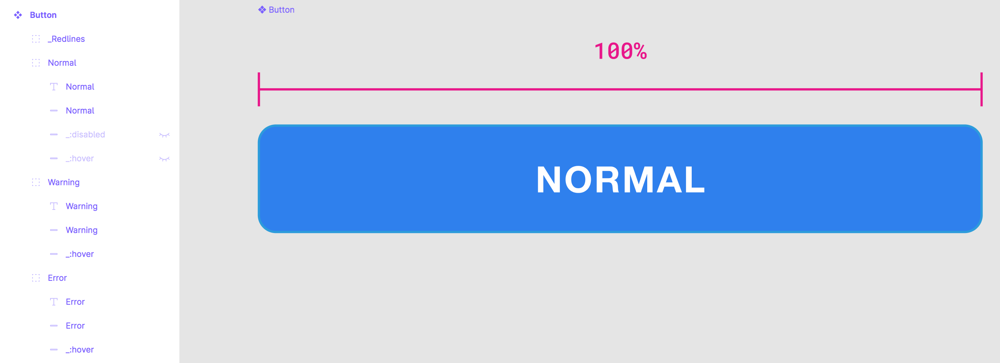
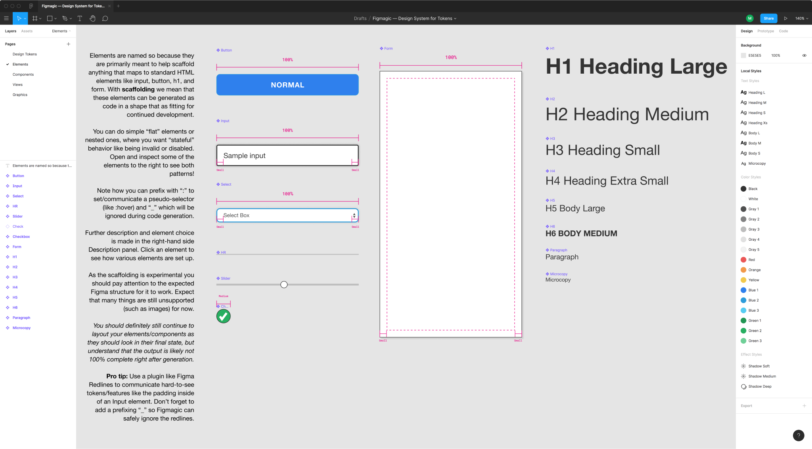
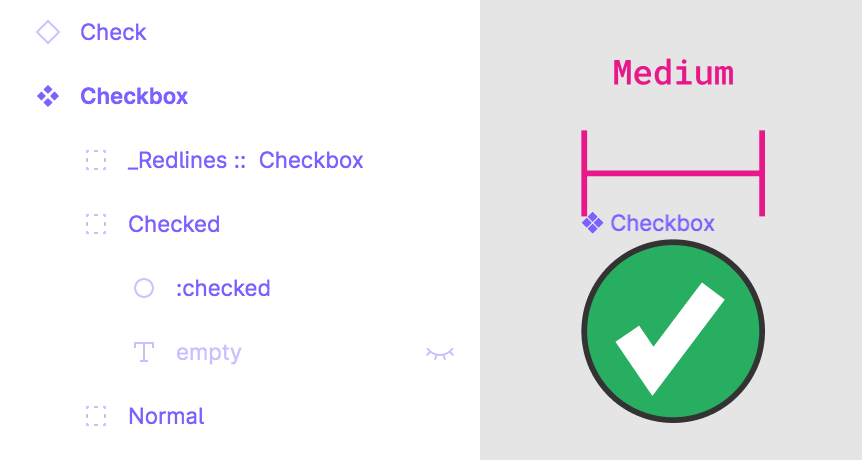
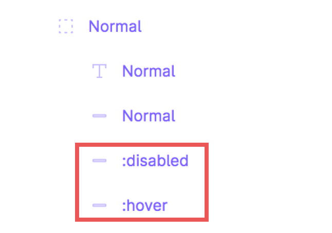

# Figmagic Element Sync

Elements are named so because they are primarily meant to help scaffold anything that maps to standard HTML elements like input, button, h1, and form. With scaffolding we mean that these elements can be generated as code in a shape that is fitting for continued development. Elements are a good entrypoint both for design and for code generation, since they are relatively simple and as a concept map to HTML which is based on using tags ("elements").

Figmagic assumes that an element can have **typography** and **layout**. These are communicated through a text-layer (for typography) and a non-text layer (such as a styled rectangle) for layout.

You can do simple **flat** elements or **nested** ones, where you want “stateful” behavior like being invalid or disabled. Open and inspect some of the elements in the [Figmagic template]() to see both patterns! You can make nested elements as deep as you want, but Figmagic will currently only generate code based on the first nesting layer. If making a nested element, code will be generated according to one subclass per nested group.

_Nesting: Button. "Normal" state. Notice how the underscore is blocking ":disabled" and ":hover"._

_Nesting: Button. "Warning" state._

_Nesting: Button. "Error" state._

_Nesting: Generated code. Notice how the nested group names became CSS classes. Only the differences in those layers were promoted to their own class, eliminating redundant code._

You can prefix with `:` to set/communicate a pseudo-selector (like `:hover`) during code generation and `_` (underscore) which will make anything prefixed with that ignored during the generation step.

Further description and element choice is made in the right-hand side Description panel. Click an element in the Figmagic template to see how various elements are set up.

As the scaffolding is experimental you should pay attention to the expected Figma structure for it to work. Expect that many things are still unsupported (such as images) for now.

You should definitely still continue to layout your elements/components as they should look in their final state, but understand that the output is likely not 100% complete right after generation, nor will it always work if you do anything unsupported.

**Pro tip**: Use a plugin like [Figma Redlines](https://www.figma.com/resources/assets/figma-redlines/) to communicate hard-to-see tokens/features like the padding inside of an Input element. Don’t forget to add a prefixing `_` so Figmagic can safely ignore the redlines.

### Details and what to know about Element Sync

- On the first generation (when Figmagic does not find anything in your element output folder) it will normally generate all 5 file types (React, Storybook, Styled Components, CSS, Markdown description). When updating, it will not normally regenerate the React, Storybook or Styled Components file. This is to ensure that they have stability and that you don't risk anything when you pull fresh.
- You can write `element=`, `type=`, `placeholder=` in Figma's component description field to set those values in the generated HTML. Type and placeholder becomes React properties, and element defines the actual element type.

_Setting what the Figma component ("element", in Figmagic terms as far as we are interested) should generate in HTML terms. Also, notice how we are typing out the description for our Markdown file which can be used in, for example, Storybook._

- You can provide your own templates through `.figmagicrc` or the CLI; for expected shape see `/templates` in the Figmagic source code.
- You can skip code generation for any of the 5 generated file types through CLI or `.figmagicrc`.
- You can pass in `--forceUpdate` to force all generated files to be updated.

For specifics on how to do any CLI or RC file configuration, see documentation below.

_How a Figmagic project could be structured with elements_

### Element Sync is still experimental! Caveats, issues and gotchas

First and foremost:

_Element Sync will not solve all of your issues and you will have to creatively work around some of the current limitations in Figmagic. For example, in the case above the check is not in the actual component, as it would not be correctly picked up by Figmagic. In this case, we want to communicate design and intent to developers, but not break the code, thus moving the check out and leaving the rest in. That should solve a lot of the boilerplate work, at least, but the check needs to be added manually afterwards. Assume that you will always need to do some work! Just that it should be a lot less than without Figmagic :)_

- **Known issue**: Sometimes element syncing will fail. Sorry! It's just how it is. Try again, or maybe a couple of times, and it should be resolved. This seems to be because of some async operation that's still not 100%.
- JS/MJS format can be set for CSS and tokens, the other types have hardcoded formats for now.
- CSS class name will be taken from the layout element's name. Same story for pseudo-element naming (such as ”:checked”).
- Flat (non-nested) elements should have the layout element using the Component name (such as ”Slider”), else it will fail.

_Flat elements should be enough for most basic use cases. Don't forget to name the layout layer to the same name as your Figma component or it will break during generation!_

- Don’t use more than one object with a fill in an element (you will get only one background/background-color!).
- Elements are not self-closing (i.e. they are always `<element></element>` rather than `<element />`).
- Cannot combine groups AND flat/non-nested styling inside an element.
- Linear gradient is supported, but it does not use ”gradientHandlePositions”.

#### Nested components

- CSS output can be wonky if you don’t use at least 2 different ”variants” or ”states” in your nested component — use regular non-nested components/elements when you don’t actually have multiple variants.
- Layer order matters in nested elements! It will always pick the first layout or text element it finds.
- Currently only a single layout element per group/nested layer will be picked up.

_As of version 3.0, having more than one layout element in the same nesting group will conflict. Try to use a pattern where non-standard layout is blocked from code generation with an underscore._

_Prefixing with an underscore means we can avoid the conflict, but still clearly communicate intended behavior and style._

- Nested elements should have a text element in order to avoid breaking or getting strange CSS/behavior. This layer does not have to be visible!
- Nested elements require that you only have Groups in the base of the element.

#### Incomplete list of things that are not yet supported

- Gradients (only Linear Gradient for now)
- Easing
- Layout constraints
- Layout grid
- Images
- Blend modes
